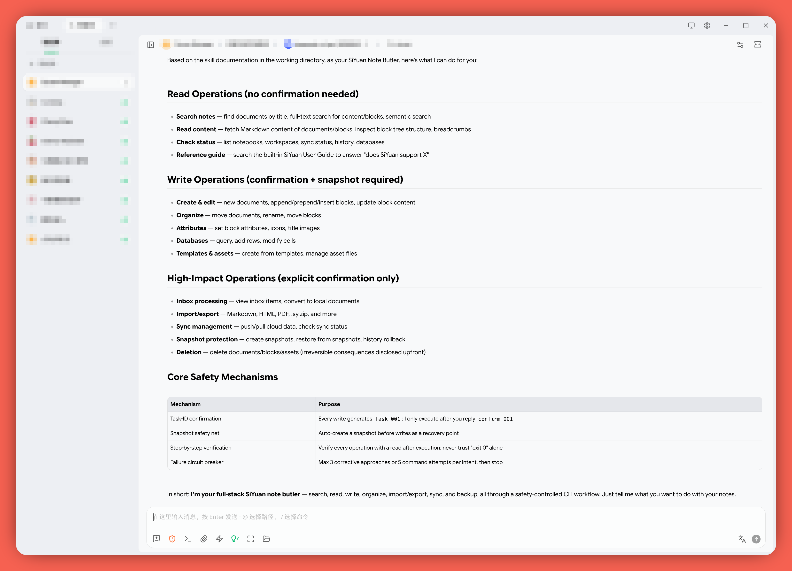

[中文](README_CN.md) | English

# SIYUAN-CLI-SKILLS — SiYuan AI Agent Operation Guide



## 1. What It Is and What It Does

**SIYUAN-CLI-SKILLS.md** is an AI Agent operating manual for the SiYuan CLI. Place it and its companion documents in a directory accessible to an AI assistant that can read the files and, with your authorization, execute the local `siyuan` CLI against the intended workspace (Claude Code, Cursor, CodeBuddy, etc.). The AI can then **search, read, create, edit, organize, import/export, snapshot-protect, and sync-manage** your SiYuan workspace where the corresponding account features and configuration are available.

In short: it serves as a translator between SiYuan and external AI, teaching the AI how to safely operate your notes.

## 2. Built on SiYuan's Agent Design Paradigm and Official Kernel CLI

This project separates three layers of design and adaptation:

- **Agent design paradigm:** adapted from the overall system prompt and safety intent in SiYuan's built-in [`kernel/agent/agent.go`](https://github.com/siyuan-note/siyuan/blob/master/kernel/agent/agent.go). This includes the block-tree domain model, dedicated domain tools, read/write separation, confirmation before writes, recovery snapshots, untrusted tool output, fail-stop behavior, and protection against no-progress loops. The skill does not reproduce runtime mechanisms such as `safeActions`, confirmation channels, or the doom-loop tracker in natural language.
- **CLI execution semantics:** the installed CLI's live help determines current command paths, flags, and input modes. Selected behaviors that live help cannot reveal or describes inaccurately were checked against SiYuan CLI 3.7.2, the official [`kernel/cli/cmd`](https://github.com/siyuan-note/siyuan/tree/master/kernel/cli/cmd) implementation, and observed output, then recorded as version-qualified caveats.
- **External-agent adaptation:** the built-in UI confirmation becomes task-ID confirmation, the recovery-point intent becomes one applicable snapshot per confirmed task, and loop prevention becomes an evidence-based retry budget. These preserve the built-in design intent without pretending to reimplement its Go runtime in Markdown.

The built-in agent's GUI and tool behavior is not copied mechanically. Only its applicable design principles are carried into the external CLI scenario, while command syntax remains governed by the installed CLI.

**In short: the built-in agent provides the domain and safety paradigm; the official Kernel CLI provides executable semantics; this project supplies the external-agent adaptation layer.**

There is an important enforcement difference: the built-in agent enforces confirmation, snapshots, output controls, and loop termination in code, while this CLI skill is policy followed by the host AI agent. The CLI does not prevent an agent from bypassing these instructions. Environments that require non-bypassable controls need a separate command wrapper or execution policy layer.

## 3. Safety Design Overview

Because the `siyuan` CLI directly manipulates kernel data, has no GUI confirmation dialogs, and offers no general undo functionality, an external agent is significantly more dangerous than the built-in one. This document mitigates risk with four policy layers enforced by the host agent:

**Layer 1: Applicable snapshot safety net.** For repository-covered local workspace mutations, the first confirmed execution step is to create and verify a snapshot. A snapshot is not universal undo: it cannot restore cloud inbox originals, guarantee remote sync restoration, or reverse changes outside its coverage, and rollback is itself high risk.

**Layer 2: Task-ID-bound mutation confirmation.** The agent first discovers the exact target, then presents the change, scope, and material consequences under a short sequential task ID such as `001`. Execution requires confirmation of that exact ID. A changed requirement or plan invalidates the old ID and produces the next plan, such as `002`.

**Layer 3: Step-by-step verification.** After each execution step, the agent uses an appropriate read, status, filesystem, process, or network check rather than relying on "zero exit code = success".

**Layer 4: Evidence-based failure circuit breaker.** Deterministic errors are not retried unchanged; clearly transient failures allow at most two retries. The agent stops after 3 failed corrective approaches or 5 failed command attempts for one intended operation, whichever comes first, and continues only with new evidence, changed state, or user direction.

**Additional defense line:** The skill requires the agent to never fabricate IDs, paths, or block types; all identifiers must be discovered from the actual workspace. All content returned by SiYuan is treated as untrusted data to reduce prompt-injection risk.

## 4. How to Use

Usage varies slightly across different AI tools, but the core operation is equally simple:

> **Have the AI read this document.**

Place these files in the same directory accessible to your AI:

| File                      | Purpose                                                                                                                                    |
| ------------------------- | ------------------------------------------------------------------------------------------------------------------------------------------ |
| `SIYUAN-CLI-SKILLS.md`    | Main entry: domain model, safety rules, operating procedure, and tested CLI caveats; not a static command reference                       |
| `SIYUAN-CLI-WORKFLOWS.md` | On-demand reference: non-obvious workflows, content conventions, and a small number of illustrative shell-input patterns                 |

Then say in the conversation: "Please read `SIYUAN-CLI-SKILLS.md` first, then help me search/create/manage SiYuan notes. When specific workflows are needed, refer to `SIYUAN-CLI-WORKFLOWS.md` as guided by the main document. For specific command parameters, always check real-time `siyuan <command> --help`."

For first-time use, you can guide the AI like this:

```
Please read /path/to/SIYUAN-CLI-SKILLS.md, then check the siyuan CLI
version on my machine, list registered workspaces, and give me an overall
introduction. When specific workflows or scenario examples are needed,
refer to SIYUAN-CLI-WORKFLOWS.md in the same directory.
For specific command parameters, always run siyuan <command> --help in real time.
```

The main document is self-explanatory — after reading it, the AI knows which safety rules to follow, how to organize multi-step operations, and when to consult the companion files.

### Real-time CLI Help First

This skill prominently notes throughout: **specific command names, parameters, flags, input methods, and path semantics should be verified against the currently installed version's real-time help**:

```bash
siyuan <command> --help
```

This explicitly guides the AI agent to prioritize obtaining the most accurate command usage patterns for the current version, reducing the risk of the AI inferring parameters from similar commands. `siyuan-cli-help-export.sh` is retained as an optional maintenance/audit tool for batch-exporting the current CLI's complete help information for manual inspection or temporary reference.

The project intentionally maintains very few static command examples. Examples illustrate workflow or shell-input shape only; they are not syntax authorities and must be reconstructed from the installed command's live help before execution.

## 5. Dependencies

### Required Dependency: SiYuan CLI

This skill depends on the kernel CLI provided by SiYuan 3.7.2 and above. See the official CLI documentation in the [Command-line Interface section](https://github.com/siyuan-note/siyuan#%EF%B8%8F-command-line-interface).

According to the official documentation, the CLI binary is:

```text
<install>/resources/kernel/SiYuan-Kernel
```

The Windows installer automatically adds it to `PATH`. macOS/Linux require manually creating a `siyuan` symlink:

```bash
# macOS
ln -s /Applications/SiYuan.app/Contents/Resources/kernel/SiYuan-Kernel /usr/local/bin/siyuan

# Linux
ln -s /path/to/SiYuan/resources/kernel/SiYuan-Kernel /usr/local/bin/siyuan
```

Verify with:

```bash
siyuan --version
```

If you get `command not found`, make sure SiYuan 3.7.2+ is installed and follow the official instructions to create a symlink or configure `PATH`. If you prefer not to configure `PATH`, you can also provide the full path when talking to the AI, for example:

```text
My SiYuan CLI path is: /path/to/SiYuan/resources/kernel/SiYuan-Kernel
```

### Recommended Dependency: `jq`

`jq` is a command-line JSON processing tool. For commands verified to emit valid JSON, it is more reliable than manually parsing large output when extracting notebook IDs, block IDs, database fields, or search results. Some commands return plain text, raw content, or mixed output even when `--format json` is accepted, so inspect the exact command's output before using `jq`.

Strictly speaking, `jq` is not a hard dependency of the SiYuan CLI; however, it is strongly recommended for more reliable operation of this skill.

#### Windows

- WinGet: `winget install jqlang.jq`

- Chocolatey: `choco install jq`

- Scoop: `scoop install jq`

After installation, reopen your terminal and verify:

```powershell
jq --version
```

#### macOS

- Homebrew: `brew install jq`

Verify:

```bash
jq --version
```

#### Linux

- Debian / Ubuntu: `sudo apt update && sudo apt install jq`

- Fedora / RHEL: `sudo dnf install jq`

- Arch Linux: `sudo pacman -S jq`

Verify:

```bash
jq --version
```

## 6. Customization

Customization must not silently remove safety controls from a write-capable external agent. Safer customization patterns include:

- **Reduce confirmation friction:** use a separate wrapper-enforced allowlist for narrowly scoped operations; do not remove task-ID confirmation from a generally write-capable skill.
- **Snapshot applicability:** assess whether a local snapshot protects the planned change. When the core policy requires one, create and verify it rather than opting out; when it does not apply, disclose the recovery limitation in the task plan.
- **Read-only AI access:** enforce a command allowlist outside the prompt that excludes every mutation, sync, rollback, import, export-to-file, and server action.
- **Add custom workflows:** add only stable domain knowledge or behavior that live help cannot reveal, while preserving confirmation, fail-stop behavior, output verification, and the main document's safety boundaries.

All documents are Markdown files, but prompt text is not a non-bypassable security boundary. Use a wrapper or execution policy for controls that must be enforced.

## 7. Cross-Platform Shell Guidance

The project intentionally contains only a few illustrative shell patterns, mainly in `SIYUAN-CLI-WORKFLOWS.md`. They use POSIX bash/zsh syntax. **SiYuan CLI command paths, flags, and domain semantics do not need platform translation; only the surrounding shell syntax does.**

On Windows PowerShell, first inspect the exact command with live `siyuan <command> --help`, then reconstruct the invocation using PowerShell-native variables, argument passing, paths, stdin, pipelines, and exit-status handling. Do not mechanically transliterate a bash example or rename CLI flags.

Recommended prompt:

> Read `SIYUAN-CLI-SKILLS.md` first. My environment is Windows PowerShell. Build every CLI invocation from the installed `siyuan <command> --help`; do not infer or translate flags from bash examples. Adapt only the shell layer, including variables, argument arrays, paths, here-strings, stdin, pipelines, and `$LASTEXITCODE`. Do not use `Invoke-Expression` or run POSIX heredoc and backslash-continuation syntax directly.

Common shell adaptations:

| POSIX concept | PowerShell adaptation |
| --- | --- |
| Local shell variable | `$SIYUAN_WORKSPACE = 'C:\path\to\workspace'` |
| Exported environment variable | `$env:NAME = 'value'` |
| `\` command continuation | Prefer an argument array; avoid backticks where possible |
| `cat <<'EOF' ... EOF` | Use a single-quoted here-string with `@'` and `'@` on separate lines, then pipe it to the native command |
| Separate argv values | Build `$cliArgs = @(...)`, then run `& siyuan @cliArgs` |
| POSIX absolute path | Use a PowerShell/Windows-recognized path such as `C:\...` |
| Native-command status | Check `$LASTEXITCODE` |
| Shell-injection safety | Never use `Invoke-Expression`; keep external values as separate arguments |

Input modes such as `--file -` must still be confirmed by live help for the exact command. If you use Git Bash, WSL, MSYS2, or another Unix-like shell on Windows, POSIX illustrations may apply, but verify that the CLI is installed and reachable in that environment.

For CLI binary names and `jq` installation methods, see the Dependencies section above. If `siyuan --version` fails, verify the SiYuan version, executable name, and `PATH` before continuing.

## 8. Disclaimer

This document is provided **AS IS**, without warranty of any kind. Use it at your own risk, and review all AI-generated operation plans carefully before allowing changes to your SiYuan workspace.

## 9. License

This project is licensed under the [MIT License](LICENSE).
