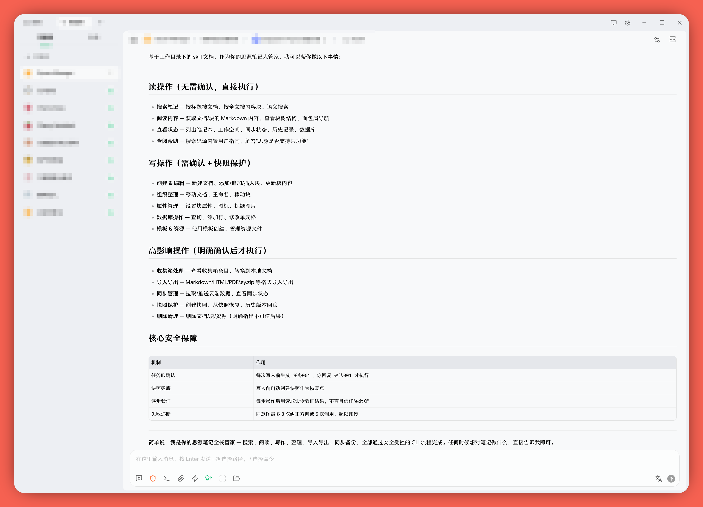

中文 | [English](README.md)

# SIYUAN-CLI-SKILLS — 思源笔记 AI Agent 操作指南



## 1. 它是什么，干什么用

**SIYUAN-CLI-SKILLS.md** 是一份 AI Agent 的思源 CLI 操作说明书。将它和配套辅助文档提供给能够读取这些文件，并可在你授权后执行本地 `siyuan` CLI、访问目标工作空间的 AI 助手（Claude Code、Cursor、CodeBuddy 等），在相应账户功能和配置可用时，这个 AI 就能帮你**搜索、阅读、创建、编辑、组织、导入导出、快照保护、同步管理**思源工作空间。

简单说：它是思源笔记和外部 AI 之间的翻译官，让 AI 知道怎么安全地操作你的笔记。

## 2. 基于思源内置 Agent 设计范式与官方 Kernel CLI

本项目区分三个设计与适配层：

- **Agent 设计范式：** 参考思源内置 [`kernel/agent/agent.go`](https://github.com/siyuan-note/siyuan/blob/master/kernel/agent/agent.go) 的整体 system prompt 与安全意图，包括 block 树领域模型、专用领域工具、读写区分、写前确认、恢复快照、不可信工具输出、失败即停和防止无进展循环。文档不会用自然语言复现 `safeActions`、确认通道或 doom-loop tracker 等 runtime 机制。
- **CLI 执行语义：** 当前安装版本的实时 help 决定命令路径、参数和输入方式。对于实时 help 无法揭示或描述不准确的少量行为，本项目通过思源 CLI 3.7.3、官方 [`kernel/cli/cmd`](https://github.com/siyuan-note/siyuan/tree/master/kernel/cli/cmd) 实现和实际输出进行核对，并记录为带版本限定的 caveat。
- **外部 Agent 适配：** 使用任务 ID 承接内置 UI 确认，以每个已确认任务的一次适用快照承接恢复点意图，并通过基于证据的重试预算防止无进展循环。这些规则保留了内置设计意图，而不是在 Markdown 中重新实现 Go runtime。

内置 Agent 的 GUI 和工具行为不会被机械照搬。本项目只将适用的设计原则带入外部 CLI 场景，具体命令语法仍由当前安装的 CLI 决定。

**简单说：内置 Agent 提供领域与安全范式，官方 Kernel CLI 提供可执行语义，本项目提供面向外部 Agent 的适配层。**

这里存在重要的强制能力差异：内置 Agent 在代码层执行确认、快照、输出控制和循环终止，而这份 CLI skill 是由宿主 AI Agent 遵循的策略。CLI 不会阻止 Agent 绕过这些说明；需要不可绕过控制的环境，必须另加命令包装器或执行策略层。

## 3. 安全性设计梳理

因为 `siyuan` CLI 直接操作内核数据、无 UI 确认弹窗、无通用撤销功能，外部 agent 的危险程度远高于内置 agent。文档提供四层由宿主 agent 执行的策略保护：

**第一层：适用范围内的快照兜底。** 对 repository 覆盖的本地工作空间变更，确认后的第一执行步是创建并验证快照。快照不是通用撤销：它不能恢复云端收集箱原件、保证远端同步状态恢复或撤销覆盖范围外的变化；回滚本身也是高风险操作。

**第二层：任务 ID 绑定的写操作确认。** Agent 先发现准确目标，再以 `001` 这样的短序号展示变更内容、范围和重要后果；只有用户确认该 ID 后才执行。需求或计划发生变化时旧 ID 立即失效，并生成 `002` 等下一份计划。

**第三层：逐个验证。** 每执行一步，立即使用适用的读取、状态、文件系统、进程或网络检查，不依赖"零退出码=成功"。

**第四层：基于证据的失败熔断。** 确定性错误不得原样重试；明确的暂时性错误最多重试 2 次。同一意图出现 3 个失败的纠正方向或累计 5 个失败调用时停止，并且只有获得新证据、状态变化或用户指示后才继续。

**额外防线：** skill 要求 agent "永不编造 ID、路径、block 类型"，所有标识符必须从实际工作空间发现；所有思源返回内容视作不可信数据，以降低 prompt 注入风险。

## 4. 如何使用

不同 AI 软件的具体使用方式各有差异，但核心操作都一样简单：

> **让 AI 读取这份文档即可。**

把这几个文件放在 AI 能访问到的同一目录里：

| 文件                      | 作用                                                                                         |
| ------------------------- | -------------------------------------------------------------------------------------------- |
| `SIYUAN-CLI-SKILLS.md`    | 主入口：领域模型、安全规则、操作流程和已验证的 CLI 特例；不作为静态命令参考                 |
| `SIYUAN-CLI-WORKFLOWS.md` | 按需查阅：非显然工作流、内容规范和少量用于说明 shell 输入方式的示意性模式                   |

然后在对话中说："请先阅读 `SIYUAN-CLI-SKILLS.md`，然后帮我搜索/创建/管理思源笔记。需要具体工作流时，再按主文档指引查阅 `SIYUAN-CLI-WORKFLOWS.md`。具体命令参数以实时 `siyuan <command> --help` 为准。"

第一次使用时可以这样引导：

```
请阅读 /path/to/SIYUAN-CLI-SKILLS.md，然后检查我电脑上的 siyuan CLI
版本，列出已注册的工作空间，给我做一个总体介绍。需要具体工作流或
场景示例时，再查阅同目录下的 SIYUAN-CLI-WORKFLOWS.md。
具体命令参数请执行实时 siyuan <command> --help 确认。
```

主文档本身就是自解释的——AI 读完就知道有哪些安全规则必须遵守、如何组织多步骤操作，以及什么时候需要查阅辅助文件。

### 实时 CLI 帮助优先

这份 skill 在重要位置均有提示：**具体命令名、参数、flag、输入方式和路径语义，以当前安装版本的实时帮助为准**：

```bash
siyuan <command> --help
```

此举可明确指导AI Agent优先获取当前版本最准确的命令使用范式，并减少 AI 从相似命令中误推参数的风险。`siyuan-cli-help-export.sh` 作为可选维护/审计工具保留，用来批量导出当前 CLI 的完整帮助信息供人工检查或临时参考。

本项目有意只保留极少量静态命令示例。示例仅用于说明工作流或 shell 输入方式，不是命令语法权威；执行前必须根据当前安装命令的实时 help 重新构造。

### 上游版本同步维护

[`upstream-sync-checklist.md`](upstream-sync-checklist.md) 是维护者审查思源新版本时使用的英文框架。它指导维护者从当前 skill、实时 CLI、源码 diff 和上游文档中动态发现并分类变化，避免再维护一份容易过时的静态更新列表。正常的 Agent 操作不需要读取该文件。

## 5. 依赖

### 必需依赖：思源 CLI

这份 skill 依赖思源 3.7.2 及以上版本提供的内核 CLI。官方 CLI 说明见[Command-line Interface一节](https://github.com/siyuan-note/siyuan#%EF%B8%8F-command-line-interface)

根据官方说明，CLI 二进制是：

```text
<install>/resources/kernel/SiYuan-Kernel
```

Windows installer 会自动把它加入 `PATH`。macOS/Linux 需要手动创建 `siyuan` symlink：

```bash
# macOS
ln -s /Applications/SiYuan.app/Contents/Resources/kernel/SiYuan-Kernel /usr/local/bin/siyuan

# Linux
ln -s /path/to/SiYuan/resources/kernel/SiYuan-Kernel /usr/local/bin/siyuan
```

可以用下面的命令检查：

```bash
siyuan --version
```

如果提示 `command not found`，请先确认思源 3.7.2+ 已安装，并按照官方说明创建 symlink 或配置 `PATH`。如果不想配置 `PATH`，也可以在使用时把完整路径告诉 AI，例如：

```text
我的思源 CLI 路径是：/path/to/SiYuan/resources/kernel/SiYuan-Kernel
```

### 推荐依赖：`jq`

`jq` 是命令行 JSON 处理工具。对于已经确认会输出有效 JSON 的命令，AI Agent 在提取 notebook ID、block ID、数据库字段或搜索结果时，用 `jq` 会比直接解析大段输出更可靠。部分命令即使接受 `--format json`，仍会返回纯文本、原始内容或混合输出，因此使用 `jq` 前必须先检查该命令的实际输出。

严格来说，`jq` 不是思源 CLI 的硬性依赖；但为了让这份 skill 更可靠，强烈建议安装。

#### Windows

- WinGet: `winget install jqlang.jq`

- Chocolatey: `choco install jq`

- Scoop: `scoop install jq`

安装后重新打开终端，检查：

```powershell
jq --version
```

#### macOS

- Homebrew: `brew install jq`

检查：

```bash
jq --version
```

#### Linux

- Debian / Ubuntu: `sudo apt update && sudo apt install jq`

- Fedora / RHEL: `sudo dnf install jq`

- Arch Linux: `sudo pacman -S jq`

检查：

```bash
jq --version
```

## 6. 按需定制

定制时不能静默移除外部写入 Agent 的安全控制。更安全的方式包括：

- **减少确认频率：** 使用独立 wrapper 对极窄范围操作做强制 allowlist；不要从通用写入 skill 中删除任务 ID 确认规则。
- **判断快照适用性：** 评估本地快照能否保护计划中的变更。核心策略要求快照时必须创建并验证，不得选择跳过；快照不适用时，应在任务计划中说明恢复能力限制。
- **只读 AI：** 在提示词之外强制命令 allowlist，排除所有写入、同步、回滚、导入、文件导出和服务启动操作。
- **添加自定义工作流：** 只添加稳定领域知识或实时 help 无法揭示的行为，同时保留确认、失败即停、输出验证和主文档安全边界。

文档虽然都是 Markdown，但提示词不是不可绕过的安全边界。必须强制执行的控制应放在 wrapper 或执行策略层。

## 7. 跨平台 Shell 指引

本项目有意只包含少量示意性 shell 模式，主要位于 `SIYUAN-CLI-WORKFLOWS.md`，并采用 POSIX bash/zsh 语法。**思源 CLI 的命令路径、flag 和领域语义不需要跨平台翻译；需要适配的只是外围 shell 语法。**

在 Windows PowerShell 中，应先通过实时 `siyuan <command> --help` 检查准确命令，再使用 PowerShell 原生变量、参数传递、路径、stdin、pipeline 和退出状态处理方式重新构造。不要机械转写 bash 示例，也不要改写 CLI flag 名称。

推荐提示词：

> 请先阅读 `SIYUAN-CLI-SKILLS.md`。我的环境是 Windows PowerShell。每条 CLI 调用都必须根据当前安装版本的 `siyuan <command> --help` 构造，不要从 bash 示例推断或翻译 flag。只适配 shell 层，包括变量、参数数组、路径、here-string、stdin、pipeline 和 `$LASTEXITCODE`。不要使用 `Invoke-Expression`，也不要直接运行 POSIX heredoc 或反斜杠续行语法。

常见 shell 适配：

| POSIX 概念 | PowerShell 做法 |
| --- | --- |
| 本地 shell 变量 | `$SIYUAN_WORKSPACE = 'C:\path\to\workspace'` |
| 导出的环境变量 | `$env:NAME = 'value'` |
| `\` 命令续行 | 优先使用参数数组，尽量避免反引号续行 |
| `cat <<'EOF' ... EOF` | 使用单引号 here-string，并将 `@'` 和 `'@` 分别独占一行，再通过 pipeline 输入 native command |
| 分开传递 argv | 构造 `$cliArgs = @(...)`，再执行 `& siyuan @cliArgs` |
| POSIX 绝对路径 | 使用 PowerShell/Windows 可识别路径，例如 `C:\...` |
| native command 状态 | 检查 `$LASTEXITCODE` |
| shell injection 防护 | 不使用 `Invoke-Expression`；外部值始终作为独立参数传入 |

`--file -` 等输入方式仍必须通过具体命令的实时 help 确认。如果在 Windows 中使用 Git Bash、WSL、MSYS2 等类 Unix shell，可以参考 POSIX 示例，但仍应确认 CLI 已安装且在该环境中可访问。

CLI 二进制名称和 `jq` 安装方式见上面的“依赖”章节。如果 `siyuan --version` 失败，请检查思源版本、可执行文件名称和 `PATH` 后再继续。

## 8. 免责声明

本文档按 **AS IS（原样）** 提供，不附带任何形式的保证。使用风险由你自行承担；在允许 AI 修改思源工作空间前，请仔细审阅所有 AI 生成的操作计划。

## 9. License

本项目基于 [MIT License](LICENSE) 授权。
